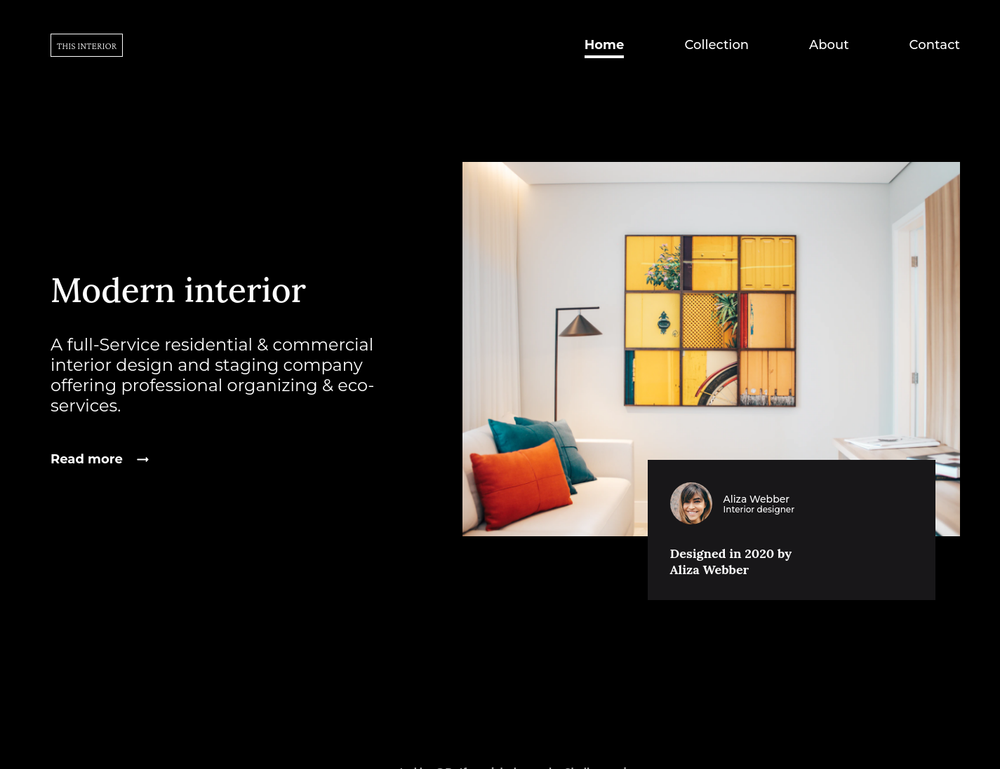

<!-- Please update value in the {}  -->

<h1 align="center">{Interior-consultant-page}</h1>

   Solution for a challenge from  <a href="http://devchallenges.io" target="_blank">Devchallenges.io</a>.

  <h3>
    <a href="https://DoInterior-consultant.surge.sh">
      Demo
    </a>
     | 
    <a href="https://github.com/DoIfeanyichukwu/interior-consultant-master">
      Solution
    </a>
     | 
    <a href="https://devchallenges.io/challenges/Jymh2b2FyebRTUljkNcb">
      Challenge
    </a>
  </h3>

<!-- TABLE OF CONTENTS -->

## Table of Contents

- [Overview](#overview)
  - [Built With](#built-with)
- [Features](#features)
- [Contact](#contact)
- [Acknowledgements](#acknowledgements)

<!-- OVERVIEW -->

## Overview

Developing mobile navigations with html and css was quite difficult for me damn.
I was torn between using buttons for the menu and close icons, and using pseudo class ::before and ::after.

I ended with using buttons over psuedo classes.

There are not enough resources explaining the implementation of mobile menus, whether to use buttons or not.

I hope my solution helps you, But if you find a better solution please share with me. thankyou.

- Where can I see your demo?
  - demo can be found [here](https://DoInterior-consultant.surge.sh)
- What was your experience?
  - i faced my confusion and now, i have something that works. i.e the mobile navigation implementation.
- What have you learned/improved?
  - my knowledge of span tag usage.
- Your wisdom? :)
  - if trying fails, rest, then try again

### Built With

<!-- This section should list any major frameworks that you built your project using. Here are a few examples.-->

- HTML
- CSS
- JavaScript.

## Features

<!-- List the features of your application or follow the template. Don't share the figma file here :) -->

This application/site was created as a submission to a [DevChallenges](https://devchallenges.io/challenges) challenge. The [challenge](https://devchallenges.io/challenges/Jymh2b2FyebRTUljkNcb) was to build an application to complete the given user stories.

## Acknowledgements

<!-- This section should list any articles or add-ons/plugins that helps you to complete the project. This is optional but it will help you in the future. For exmpale -->

- [Steps to replicate a design with only HTML and CSS](https://devchallenges-blogs.web.app/how-to-replicate-design/)
- [Node.js](https://nodejs.org/)
- [Marked - a markdown parser](https://github.com/chjj/marked)

## Contact

- GitHub [@DoIfeanyichukwu](https://{github.com/DoIfeanyichukw})
- Twitter [@DoIfeanyichukwu](https://{twitter.com/DoIfeanyichukwu})
